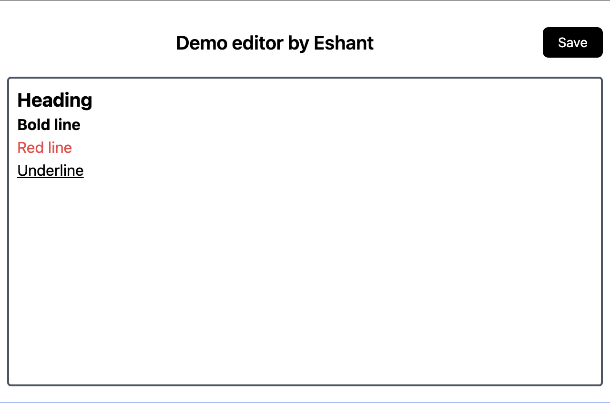

# Note draft editor

A simple react based editor application using draft js library.

Note - This is in development progress.

## Specification



1. Enter \# and space -> heading block
1. Enter \* and space -> bold line
1. Enter \*\* and space -> red line
1. Enter \*\*\* and space -> under line
1. Save button will save your text into localstorage

## Requirements

- Nodejs  v14+ (<https://nodejs.org/>)

## Installation

NOTE - You can clone this repository locally or fork this project by using [codesandbox repo link](https://codesandbox.io/p/github/eshant52/draft-editor/draft/determined-gagarin)

1. clone the repo
1. then do following command to run in dev

```bash
npm install
npm run dev
```
